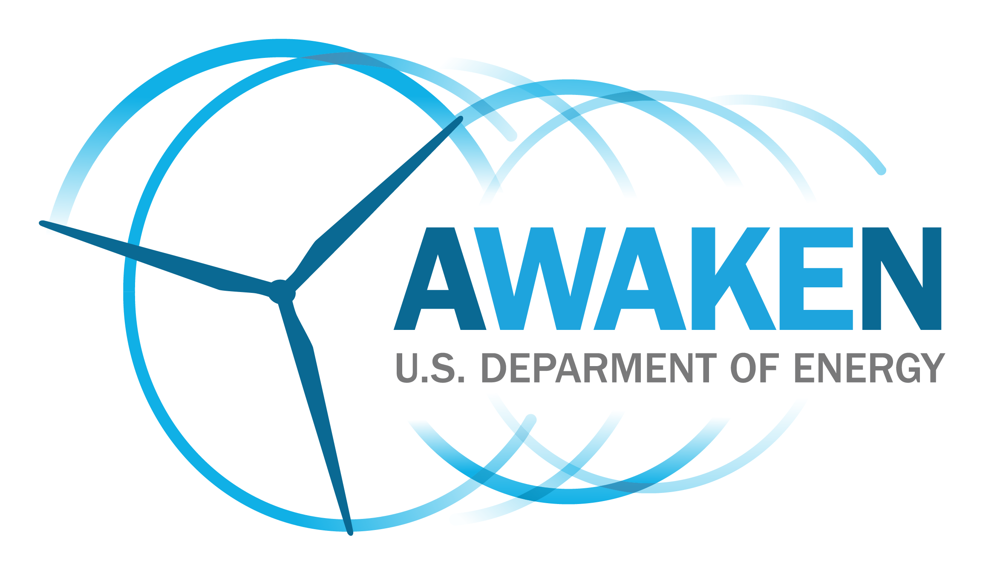

.. AWAKEN_benchmark documentation master file, created by
   sphinx-quickstart on Thu Aug 10 13:55:09 2023.
   You can adapt this file completely to your liking, but it should at least
   contain the root `toctree` directive.

The AWAKEN benchmarks
============================================

.. toctree::
   :hidden:

   testable_hypotheses
   field_site
   measurements
   benchmark_1_farmwake
   phase1
   phase2
   phase3
   what_submit
   timeline 
   glossary

The American Wake Experiment (AWAKEN) is a multi-institutional field campaign focused on gathering much-needed observations of wind farm-atmosphere interactions. These interactions are responsible for a large portion of the uncertainty in wind plant modeling tools that are used to represent wind plant performance both prior to construction and during operation, and can negatively impact wind energy profitability. The AWAKEN field campaign will provide benchmarking data for validation, ultimately improving modeling and lowering these uncertainties.

Benchmarking phases
-------------------

For each benchmark, we envision three phases:

1. Code calibration
    Modelers will use inflow measurements to calibrate their code before the blind comparison

2. Blind comparison
    - Code-to-code comparison: Simulation results from different models are compared without releasing the measurement data to identify potential errors in model configurations 
    - Code-to-data comparison: Simulation results from all participants are compared to the measurement data to provide a first assessment of the accuracy of each simulation tool

3. Iteration
    Modelers can modify their model setup after performing model-measurement comparison to improve agreement