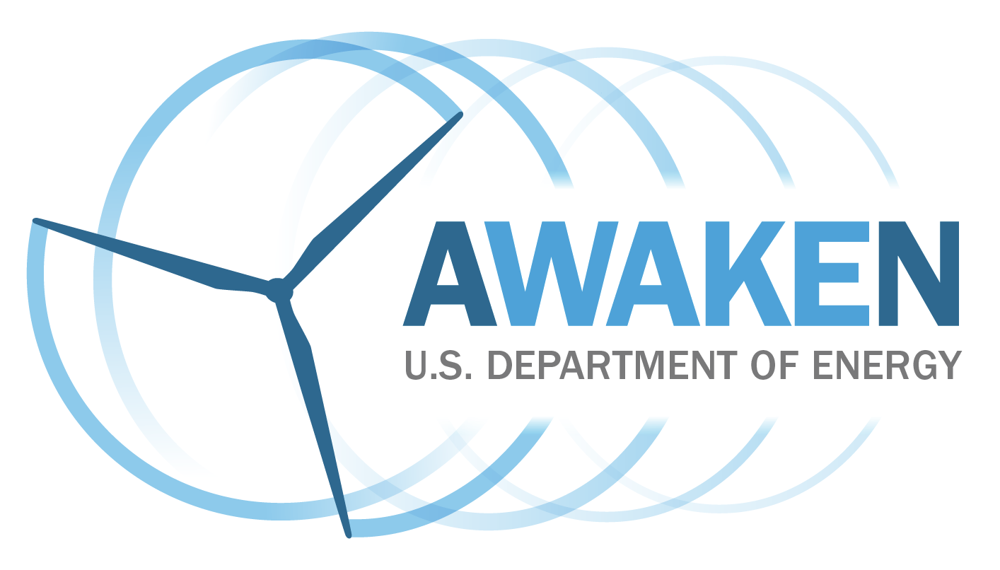

.. AWAKEN_benchmark documentation master file, created by
   sphinx-quickstart on Thu Aug 10 13:55:09 2023.
   You can adapt this file completely to your liking, but it should at least
   contain the root `toctree` directive.

The AWAKEN benchmarks
============================================

.. toctree::
   :hidden:

   testable_hypotheses
   field_site
   measurements
   benchmark_1_farmwake
   signup
   phase1
   phase2
   phase3
   what_submit
   timeline 
   glossary
   contact

The American Wake Experiment (AWAKEN) is a multi-institutional field campaign focused on gathering much-needed observations of wind farm-atmosphere interactions. These interactions are responsible for a large portion of the uncertainty in wind plant modeling tools that are used to represent wind plant performance both prior to construction and during operation, and can negatively impact wind energy profitability. The AWAKEN field campaign will provide benchmarking data for validation, ultimately improving modeling and lowering these uncertainties.

Benchmarking phases
-------------------

For each benchmark, we envision three phases:

1. The baseline
    Modelers leverage the limited inputs and their own best practices to simulate the processes of interest.

2. Model improvement with inflow observations
    The participants leverage additional inflow observations and what learnt in Phase 1 to simulate the processes of interest.

3. Model improvement with inflow and wake observations
    The participants leverage the additional wake observations and what learnt in Phase 2 to simulate the processes of interest.